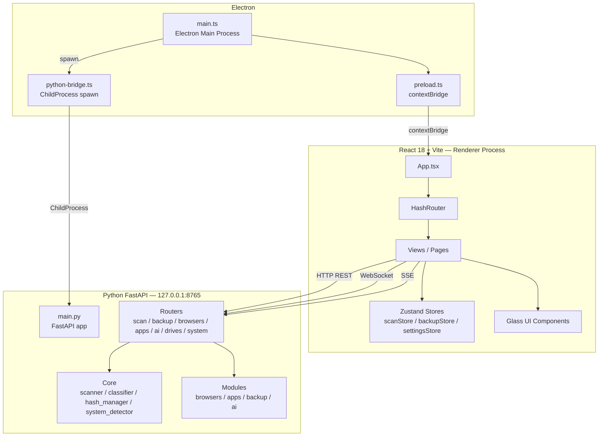

# Design Document — Suggy Sweep

## Overview

Suggy Sweep — десктопное приложение для Windows, помогающее пользователям подготовиться к переустановке операционной системы. Приложение сканирует файловую систему, классифицирует пользовательские файлы, объясняет их назначение через AI, и позволяет создать верифицированную резервную копию на внешний носитель с последующим восстановлением.

Стек: **Electron 28** (оболочка) + **React 18 + TypeScript + Vite** (UI) + **Python 3.11 FastAPI** (бэкенд). Интерфейс выполнен в стиле Liquid Glass UI (тёмная тема, glassmorphism).

Приложение работает исключительно на Windows 10/11 и не требует интернет-соединения, кроме запросов к Lovable AI Gateway.

---

## Architecture

### Общая схема



### Процессы и коммуникация

| Канал | Протокол | Использование |
|---|---|---|
| Electron Main ↔ Renderer | contextBridge IPC | версия приложения, safeStorage для API-ключа |
| Frontend ↔ Backend (данные) | HTTP REST | системная информация, диски, браузеры, приложения, бэкап |
| Frontend ↔ Backend (сканирование) | WebSocket | real-time поток файлов во время сканирования |
| Frontend ↔ Backend (AI) | SSE (Server-Sent Events) | потоковая передача ответов AI |

Backend запускается Electron как дочерний процесс (`spawn("python", ["backend/main.py"])`) и слушает только на `127.0.0.1:8765`. При закрытии приложения Electron завершает дочерний процесс.

Electron ожидает готовности бэкенда (polling `GET /api/system/info` каждые 500 мс, таймаут 10 секунд) перед показом главного окна.

---

## Components and Interfaces

### Electron Layer

**`electron/main.ts`**
- Создаёт `BrowserWindow` (1440×900, min 1024×768, `titleBarStyle: "hidden"`)
- Вызывает `startBackend()` при старте, `stopBackend()` при закрытии
- Ожидает готовности бэкенда перед `win.loadURL()`

**`electron/python-bridge.ts`**
- `startBackend()` — spawn Python процесса, перенаправляет stdio
- `stopBackend()` — kill дочернего процесса
- `waitForBackend(timeoutMs: number): Promise<boolean>` — polling health-check

**`electron/preload.ts`**
- `contextBridge.exposeInMainWorld("suggy", { version, encryptKey, decryptKey })`
- `encryptKey` / `decryptKey` — обёртки над `safeStorage` для хранения AI API-ключа

### Frontend Layer

#### App Shell

```
AppShell
├── TitleBar (macOS-style traffic lights + drag region)
├── Sidebar (260px glass panel)
│   ├── NavItem × 10 (с иконками @phosphor-icons/react)
│   └── LiveStats (файлы, размер, статус бэкапа)
└── MainContent (HashRouter outlet)
    ├── DashboardView
    ├── ScannerView
    ├── FilesView
    ├── BrowsersView
    ├── AppsView
    ├── BackupView (BackupWizard 4 шага)
    ├── RestoreView
    ├── AIChatView
    ├── SystemInfoView
    └── SettingsView
```

#### Zustand Stores

```typescript
// scanStore
interface ScanStore {
  status: 'idle' | 'scanning' | 'complete' | 'error'
  files: FileInfo[]
  categories: Record<string, CategoryInfo>
  totalFiles: number
  totalSize: number
  currentFile: string
  exclusions: string[]  // из settingsStore
}

// backupStore
interface BackupStore {
  status: 'idle' | 'running' | 'verifying' | 'complete' | 'error'
  progress: BackupProgress
  lastManifestPath: string | null
}

// settingsStore
interface SettingsStore {
  theme: 'dark' | 'light'
  aiModel: string
  defaultBackupDir: string
  archiveFormat: 'zip' | '7z'
  compressionLevel: number
  exclusions: string[]
}
```

#### Glass UI Component Library (`frontend/src/components/glass/`)

Все компоненты используют CSS-переменные:

```css
--glass-bg: rgba(255,255,255,0.06)
--glass-blur: 24px
--glass-saturation: 180%
--glass-border: rgba(255,255,255,0.12)
--glass-radius: 16px
```

| Компонент | Описание |
|---|---|
| `GlassPanel` | базовый контейнер с backdrop-filter |
| `GlassButton` | кнопка с hover/active анимацией |
| `GlassCard` | карточка с тенью и border |
| `GlassInput` | поле ввода |
| `GlassSelect` | выпадающий список |
| `GlassModal` | модальное окно с overlay |
| `GlassProgress` | прогресс-бар |
| `GlassToggle` | переключатель |
| `GlassCheckbox` | чекбокс |
| `GlassBadge` | бейдж/метка |
| `GlassTooltip` | подсказка |

Анимированный фон: `background-size: 400%`, `animation: gradientShift 15s ease infinite`.

### Backend Layer

#### Core Modules

**`backend/core/scanner.py` — `FileScanner`**
```python
class FileScanner:
    def scan(
        self,
        paths: list[str] | None,
        include_appdata: bool,
        exclusions: list[str]  # glob-паттерны исключений
    ) -> Generator[FileInfo, None, None]: ...
    
    def _categorize(self, ext: str) -> str: ...
    def _is_excluded(self, path: str, exclusions: list[str]) -> bool: ...
```

**`backend/core/file_classifier.py` — `FileClassifier`**
```python
EXTENSION_MAP: dict[str, str]  # ext -> category, без дублей

class FileClassifier:
    @staticmethod
    def classify(ext: str) -> str: ...
    
    @staticmethod
    def all_extensions() -> set[str]: ...
```

**`backend/core/hash_manager.py` — `HashManager`**
```python
class HashManager:
    @staticmethod
    def sha256(path: str) -> str: ...
    
    @staticmethod
    def verify(path: str, expected_hash: str) -> bool: ...
```

**`backend/core/system_detector.py` — `SystemDetector`**
```python
class SystemDetector:
    @staticmethod
    def detect() -> SystemInfo: ...  # winreg + platform
```

#### Feature Modules

**`backend/browsers/detector.py` — `BrowserDetector`**
- Поддерживаемые браузеры: Chrome, Edge, Firefox, Opera, Opera GX, Brave, Vivaldi, Yandex Browser
- Обнаружение через реестр (`HKCU\Software`) и стандартные пути профилей
- Экспорт: закладки (JSON), история (SQLite копия), расширения (JSON), пароли (предупреждение о закрытии браузера)

**`backend/apps/detector.py` — `AppDetector`**
- Поддерживаемые приложения: Telegram Desktop, AyuGram, 64Gram, Kotatogram, Discord (+ Canary, PTB), Steam, VS Code, OBS Studio, qBittorrent, FileZilla, PuTTY, Notepad++
- Обнаружение через реестр и стандартные пути
- Дополнительно: Git config, SSH ключи, WSL config

**`backend/apps/telegram.py` — `TelegramExporter`**
- Portable-режим: поиск `tdata` рядом с исполняемым файлом
- Installed-режим: `%APPDATA%\Telegram Desktop\tdata`

**`backend/backup/backup_manager.py` — `BackupManager`**
```python
class BackupManager:
    async def create(
        self,
        files: list[str],
        dest_dir: str,
        settings: BackupSettings,
        progress_cb: Callable[[BackupProgress], None]
    ) -> BackupManifest: ...
    
    async def verify(self, manifest: BackupManifest, backup_dir: str) -> VerifyResult: ...
```

**`backend/backup/manifest.py` — `Manifest`**
```python
class Manifest:
    @staticmethod
    def serialize(manifest: BackupManifest) -> str: ...  # -> JSON string
    
    @staticmethod
    def deserialize(json_str: str) -> BackupManifest: ...  # raises ManifestError on invalid
    
    @staticmethod
    def validate(manifest: BackupManifest) -> None: ...  # raises ValidationError
```

**`backend/backup/drive_manager.py` — `DriveManager`**
- `list_drives() -> list[DriveInfo]` — через `ctypes` WinAPI (`GetLogicalDrives`, `GetDriveTypeW`, `GetDiskFreeSpaceExW`)
- `check_space(drive: str, required_bytes: int) -> bool`

**`backend/backup/restore_manager.py` — `RestoreManager`**
```python
class RestoreManager:
    async def restore(
        self,
        manifest: BackupManifest,
        backup_dir: str,
        dest_dir: str | None,
        selected_files: list[str] | None,
        password: str | None,
        progress_cb: Callable[[RestoreProgress], None]
    ) -> RestoreResult: ...
```

**`backend/ai/lovable_client.py` — `LovableAIClient`**
- Модель по умолчанию: `google/gemini-3-flash-preview`
- Системный промпт на русском языке
- Методы: `analyze_file`, `analyze_directory`, `chat`, `recommendations`
- Все ответы — async generators (SSE)

#### Routers

| Файл | Prefix | Методы |
|---|---|---|
| `routers/scan.py` | `/api/scan` | `WS /ws/scan`, `POST /quick-scan` |
| `routers/backup.py` | `/api/backup` | `POST /create`, `POST /restore` |
| `routers/browsers.py` | `/api/browsers` | `GET /detect`, `POST /export` |
| `routers/apps.py` | `/api/apps` | `GET /detect`, `POST /export`, `POST /reinstall-script` |
| `routers/ai.py` | `/api/ai` | `POST /analyze-file` (SSE), `POST /analyze-directory` (SSE), `POST /chat` (SSE), `POST /recommendations` (SSE) |
| `routers/drives.py` | `/api/drives` | `GET /list`, `POST /check-space` |
| `routers/system.py` | `/api/system` | `GET /info`, `GET /wifi-passwords`, `GET /drivers`, `POST /export-registry`, `GET /scheduled-tasks`, `GET /env-vars`, `GET /printers`, `GET /fonts`, `GET /sticky-notes` |

---

## Data Models

### FileInfo
```typescript
interface FileInfo {
  path: string          // абсолютный путь
  name: string          // имя файла
  extension: string     // расширение в нижнем регистре (напр. ".pdf")
  size: number          // байты
  modified: string      // ISO 8601
  created: string       // ISO 8601
  category: string      // "Документы" | "Изображения" | "Видео" | "Музыка" | "Архивы" | "Код/Проекты" | "AppData" | "Другое"
  is_hidden: boolean
}
```

### ScanResult / CategoryInfo
```typescript
interface CategoryInfo {
  count: number
  size: number
  files: FileInfo[]
}

interface ScanResult {
  categories: Record<string, CategoryInfo>
  total_files: number
  total_size: number
}
```

### BackupManifest
```typescript
interface BackupManifest {
  version: number           // версия формата манифеста (текущая: 1)
  created_at: string        // ISO 8601
  app_version: string       // версия Suggy Sweep
  files: ManifestFile[]
  settings: BackupSettings
}

interface ManifestFile {
  original_path: string
  backup_path: string       // относительный путь внутри архива
  size: number
  sha256: string
  category: string
}

interface BackupSettings {
  format: 'zip' | '7z'
  compression_level: number  // 0-9
  encrypted: boolean
  split_size_mb: number | null
}
```

### DriveInfo
```typescript
interface DriveInfo {
  letter: string        // "C", "D", ...
  path: string          // "C:\\"
  label: string
  type: 'fixed' | 'removable' | 'network' | 'cdrom' | 'unknown'
  filesystem: string    // "NTFS", "FAT32", ...
  total_bytes: number
  free_bytes: number
  is_system: boolean
  is_removable: boolean
}
```

### BrowserProfile
```typescript
interface BrowserProfile {
  name: string
  path: string
  bookmarks: boolean
  extensions: boolean
  has_passwords: boolean
  has_cookies: boolean
  has_history: boolean
}
```

### Ошибки Backend
```typescript
interface ApiError {
  error: string    // краткое описание
  detail: string   // подробности
  code: number     // HTTP-статус
}
```

---

## Correctness Properties

*A property is a characteristic or behavior that should hold true across all valid executions of a system — essentially, a formal statement about what the system should do. Properties serve as the bridge between human-readable specifications and machine-verifiable correctness guarantees.*

### Property 1: Manifest Round-Trip

*For any* valid `BackupManifest` object, serializing it to JSON and then deserializing the result must produce an object equivalent to the original.

**Validates: Requirements 15.4**

### Property 2: Scanner Exclusion

*For any* set of exclusion glob-patterns and any file whose path matches at least one of those patterns, that file must not appear in the results returned by `FileScanner.scan()`.

**Validates: Requirements 4.8**

### Property 3: SHA-256 Hash Integrity

*For any* file that has been backed up, the SHA-256 hash of the file at its backup path must equal the `sha256` field stored in the corresponding `ManifestFile` entry.

**Validates: Requirements 9.7**

### Property 4: Drive Space Guard

*For any* backup operation where the total size of selected files exceeds the free bytes on the destination drive, the backup must not proceed and must return an error indicating insufficient space.

**Validates: Requirements 9.3 (design decision)**

### Property 5: Category Classification Uniqueness

*For any* known file extension in `FileClassifier.EXTENSION_MAP`, that extension must map to exactly one category — no extension may appear in two categories, and every extension in the map must return a non-empty category string.

**Validates: Requirements 4.2 (design decision)**

### Property 6: Manifest Validation Rejects Incomplete Manifests

*For any* manifest object missing one or more required fields (`version`, `created_at`, `app_version`, `files`, `settings`), or containing fields of incorrect types, `Manifest.validate()` must raise a `ValidationError`.

**Validates: Requirements 15.5**

### Property 7: Scanner File Fields Completeness

*For any* accessible file yielded by `FileScanner.scan()`, the resulting `FileInfo` dict must contain all required fields (`path`, `name`, `extension`, `size`, `modified`, `category`) with non-null values.

**Validates: Requirements 4.2**

### Property 8: Encrypted Backup Requires Password

*For any* backup created with `encrypted: true`, attempting to restore it without providing the correct password must fail with an authentication error, and no files must be written to the destination.

**Validates: Requirements 9.10, 10.7**

---

## Error Handling

### Backend

- Все ошибки возвращаются в формате `{ error, detail, code }` (Requirement 14.5)
- Все исключения логируются в `suggy-sweep.log` в директории приложения (Requirement 14.7)
- `FileScanner` перехватывает `OSError` / `PermissionError` на уровне отдельного файла и продолжает сканирование (Requirement 4.7)
- `BackupManager` при ошибке записи одного файла логирует ошибку и продолжает (Requirement 9.9)
- `RestoreManager` при несовпадении хеша пропускает файл, логирует и продолжает (Requirement 10.6)
- `System_Collector` при отсутствии прав администратора пропускает операцию и возвращает предупреждение (Requirement 11.11)
- `Manifest.deserialize()` при невалидном JSON бросает `ManifestError` с описанием на русском языке (Requirement 15.3)

### Frontend

- Таймаут ожидания бэкенда (10 сек) → экран ошибки с кнопкой «Повторить» (Requirement 1.2)
- Разрыв WebSocket во время сканирования → toast-уведомление + кнопка перезапуска (Requirement 4.9)
- HTTP ошибки от бэкенда → `react-hot-toast` с текстом из поля `error` (Requirement 14.5)
- Пустое поле ввода AI чата → кнопка отправки заблокирована (Requirement 6.7)
- Недостаточно места на диске → предупреждение в мастере бэкапа (Requirement 9.3)

### Стратегия логирования

```
[TIMESTAMP] [LEVEL] [MODULE] message
```

Уровни: `INFO`, `WARNING`, `ERROR`. Файл: `%APPDATA%\SuggySweep\suggy-sweep.log`.

---

## Testing Strategy

### Подход

Используется двойная стратегия тестирования:
- **Unit-тесты** — конкретные примеры, граничные случаи, интеграционные точки
- **Property-based тесты** — универсальные свойства, проверяемые на большом количестве сгенерированных входных данных

Оба типа тестов обязательны и дополняют друг друга.

### Property-Based Testing

**Библиотека**: [`hypothesis`](https://hypothesis.readthedocs.io/) (Python) для бэкенда.

Каждый property-тест должен:
- Запускаться минимум **100 итераций** (`@settings(max_examples=100)`)
- Содержать комментарий-тег в формате: `# Feature: suggy-sweep, Property N: <property_text>`
- Соответствовать ровно одному свойству из раздела Correctness Properties

**Property-тесты:**

```python
# Feature: suggy-sweep, Property 1: Manifest Round-Trip
@given(manifest=st.builds(BackupManifest, ...))
@settings(max_examples=100)
def test_manifest_round_trip(manifest):
    assert Manifest.deserialize(Manifest.serialize(manifest)) == manifest

# Feature: suggy-sweep, Property 2: Scanner Exclusion
@given(exclusions=st.lists(st.text()), files=st.lists(st.builds(FileInfo, ...)))
@settings(max_examples=100)
def test_scanner_exclusion(exclusions, files):
    # файлы, чьи пути совпадают с exclusions, не должны появляться в результатах

# Feature: suggy-sweep, Property 3: SHA-256 Hash Integrity
@given(content=st.binary())
@settings(max_examples=100)
def test_hash_integrity(content, tmp_path):
    # записать content, посчитать хеш, верифицировать

# Feature: suggy-sweep, Property 4: Drive Space Guard
@given(free_bytes=st.integers(min_value=0), required_bytes=st.integers(min_value=1))
@settings(max_examples=100)
def test_drive_space_guard(free_bytes, required_bytes):
    # если required > free, backup не должен запускаться

# Feature: suggy-sweep, Property 5: Category Classification Uniqueness
def test_category_uniqueness():
    # детерминированный тест: каждый ext встречается ровно в одной категории

# Feature: suggy-sweep, Property 6: Manifest Validation Rejects Incomplete
@given(manifest=st.builds(IncompleteManifest, ...))
@settings(max_examples=100)
def test_manifest_validation_rejects_incomplete(manifest):
    with pytest.raises(ValidationError):
        Manifest.validate(manifest)

# Feature: suggy-sweep, Property 7: Scanner File Fields Completeness
@given(st.just(None))
@settings(max_examples=100)
def test_scanner_fields_completeness(_, tmp_path):
    # создать временные файлы, просканировать, проверить все поля

# Feature: suggy-sweep, Property 8: Encrypted Backup Requires Password
@given(password=st.text(min_size=1), wrong_password=st.text(min_size=1))
@settings(max_examples=100)
def test_encrypted_backup_requires_password(password, wrong_password):
    assume(password != wrong_password)
    # создать зашифрованный бэкап, попытаться восстановить с wrong_password → ошибка
```

### Unit-тесты

**Бэкенд (pytest):**
- `test_system_detector.py` — корректное определение Windows 10/11 по build number
- `test_file_classifier.py` — классификация конкретных расширений
- `test_hash_manager.py` — SHA-256 для известных входных данных
- `test_manifest.py` — сериализация/десериализация конкретных манифестов, невалидный JSON
- `test_scanner.py` — сканирование временной директории, исключения
- `test_backup_manager.py` — создание ZIP/7z, верификация, ошибки записи
- `test_restore_manager.py` — восстановление, повреждённый файл, зашифрованный архив
- `test_drive_manager.py` — мок WinAPI, проверка пространства

**Фронтенд (Vitest + React Testing Library):**
- `AppShell.test.tsx` — рендер без краша
- `Sidebar.test.tsx` — навигация между разделами
- `BackupWizard.test.tsx` — прохождение 4 шагов
- `AIChatPanel.test.tsx` — блокировка отправки при пустом вводе
- `glass/*.test.tsx` — рендер каждого Glass-компонента

### Запуск тестов

```bash
# Бэкенд
cd backend && pytest --tb=short

# Фронтенд (одиночный запуск)
cd frontend && npx vitest --run
```
